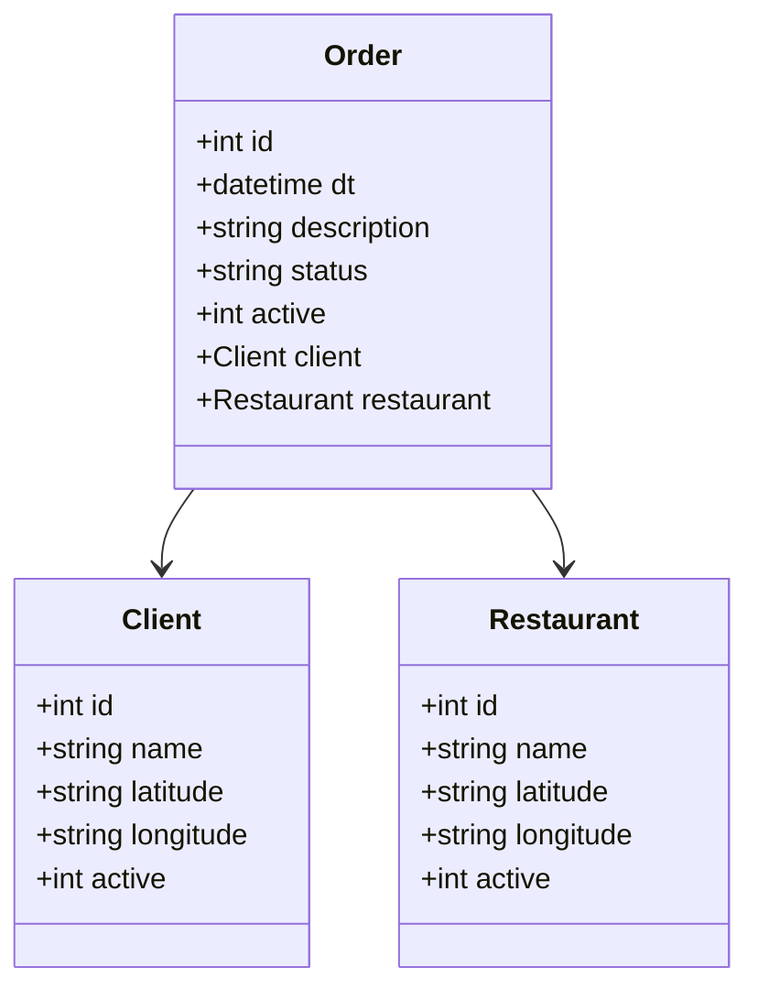

# Project - Order Map

RESTful API OrderMap 2025 built with Java 17 and Spring Boot 3.

## Main Technologies

- **Java 17**: We use the latest LTS version of Java to take advantage of the newest features of this robust and widely adopted language;
- **Spring Boot 3**: We work with the newest version of Spring Boot, which boosts developer productivity through its powerful auto-configuration capabilities;
- **Spring Data JPA**: We explore how this tool simplifies the data access layer and facilitates integration with SQL databases;
- **OpenAPI (Swagger)**: We create clear and effective API documentation using OpenAPI (Swagger), perfectly aligned with Spring Boot's productivity-focused ecosystem;

## Domain Model

